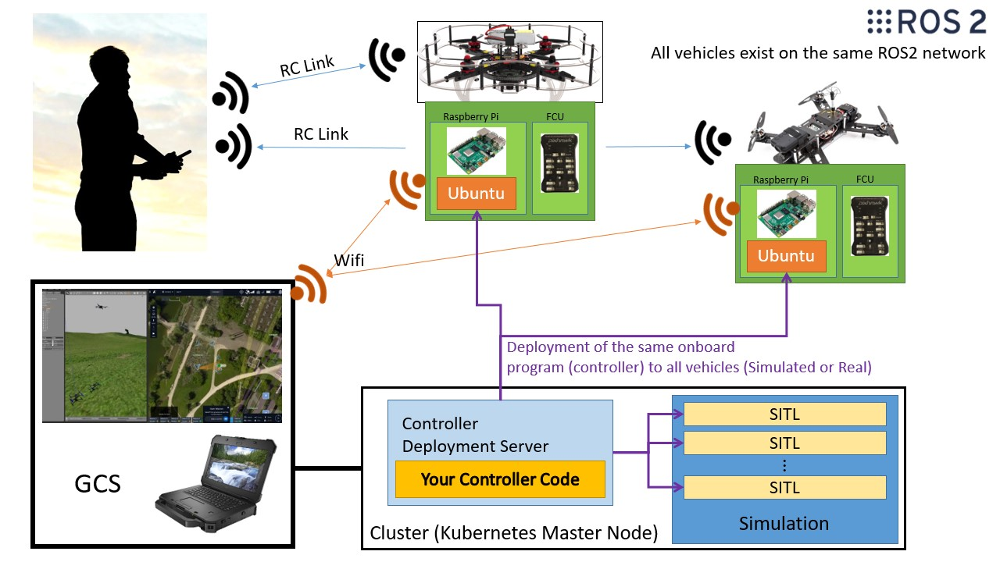

# Project Starling

The purpose of Starling is to update the control systems within the Bristol Robotics Laboratory Flight Arena in order to reduce the barrier to entry for those who wish to experiment with, and fly real drones.

This project takes recent advancements in cloud computing, namely containerisation (docker) and container orchestration (kubernetes) as the core framework to manage networking and drone deployment, whether virtual (using SITL) or on real drones running companion computers (e.g. raspberry pi).

However a key requirement of the system is to allow users to be able to operate drones without needing to know more about the udnerlying implementation.

This systems provides a number of key features.

- Primary support for ROS2 and MavLink
- Built in simulation stack based on Gazebo
- Quick transition from simulation to flying controllers on real drones.



## Documentation

Please refer to the documentation at [https://docs.starlinguas.dev/](https://docs.starlinguas.dev/) for detailed instructions and explanations of how to use this system.

The documentation is built using [MKDocs](https://www.mkdocs.org/) and can be served locally.

1. Install requirements `pip install -r docs/requirements.txt`
2. In the project root, run `make docs` or `make serve-docs` if you want live viewing (serving to `localhost:8000`)

## Setup

For the simplest usage, a simple Command Line Interface and examples are available in the [Murmuration repository](https://github.com/StarlingUAS/Murmuration). Refer to the documentation for furhter details.
```
git clone https://github.com/StarlingUAS/Murmuration.git
```

For inspecting and developing core Starling clone the repository recursively so that all submodules are included.
```
git clone --recurse-submodules https://github.com/StarlingUAS/ProjectStarling.git
```

## Features
### Drone Sandbox

Starling encapsulates much of the set up and configuration required for you to get your drone based experiments up and running. It encapsulates the installation and running of simulators (e.g. Gazebo), the configuration of Software-In-The-Loop (SITL) for common autopilot software (e.g. PX4 or Ardupilot) and the deployment of these systems across a network of machines.

This streamlines the controller development process, and hopefully allows you to develop your controllers and experiments much faster and more directly, hopefully without having to deal with lower level configuration or networking issues.

### Simulation to Reality

Due to using containerisation, all these packages are availble to be deployed on any machine at a moments notice. This includes the companion computer on your vehicle. This way you can write and test code against the simulator to later be executed on the real vehicles with no change on your end.

### Single and Multiple Drones

Starling supports both single and multiple drone centralised and decentralised applications out of the box as a nice side effect of the architecture of the system. Multiple drones are generated by simply scaling the drone process, in theory allowing for as many drones as your machine can handle.

By virtue of the architecture, the system also includes failure recovery and detection mechanics.

## Contact
The initial developers of this project are:

- Mickey Li - [email](mailto:mickey.li@bristol.ac.uk) - [github](https://github.com/mhl787156)
- Robert Clarke - [email](mailto:robert.clarke@bristol.ac.uk) - [github](https://github.com/rob-clarke)

## FAQs
Please see documentation, or raise an [Issue on the github repo](https://github.com/StarlingUAS/ProjectStarling/issues)

## License
This project is released under the MIT license. Please see the [License file](https://github.com/StarlingUAS/ProjectStarling/blob/master/LICENSE) for more details.
