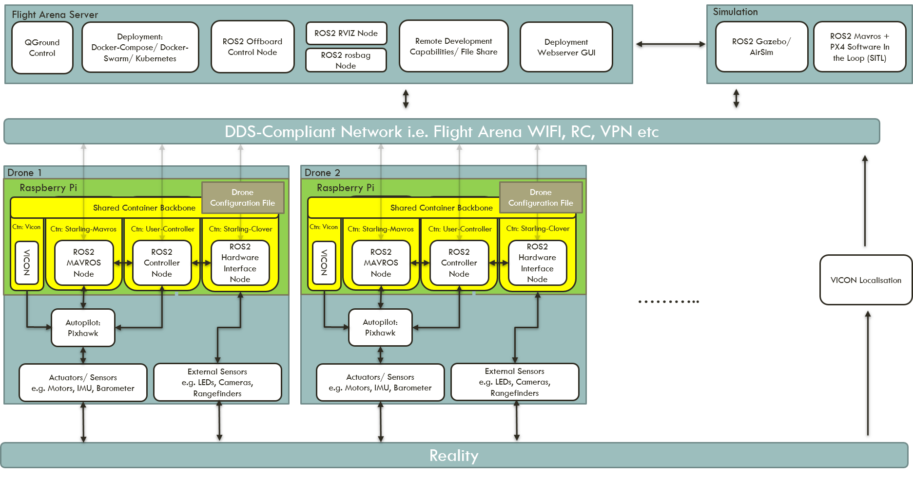
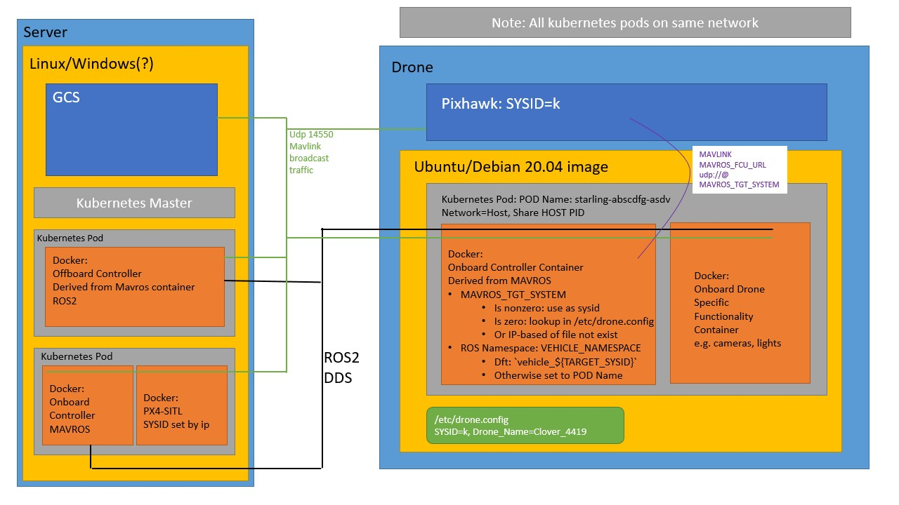

# Flight Arena Architecture and Set Up

[TOC]

## Architecture

A side effect of using kubernetes and docker is that the system is mostly network agnostic. As long as all elements of the system are on the same physical network, all elements should be able to communicate.



### Flight Arena Networking

The flight arena (FA) runs on its own airgapped local network.  The FA network exists on the CIDR subnet `192.168.10.0/24`. There is a external dhcp server sitting on `192.168.10.252` which (as of writing) is configured to serve addresses to new devices from `192.168.10.105 - 192.168.10.199`. Addresses below `105` are reserved for the flight arena machines, server and the VICON motion tracking system.

The flight arena machines then all have 2 network cards, one connecting to the flight arena network (grey cables), and one connecting to the internet via the UWE network (blue cables). These machines run from `192.168.10.83 - 192.168.10.85`. The flight arena server has been set up on `192.168.10.80` (this can also be accessed via `flyingserver.local`) and is host centralised aspects of the system.

### Starling

The kubernetes master node is set to run on the flight arena server on `192.168.10.80` or `flyingserver.local`. Any worker nodes (drones) must have the master node registered. Any machines/ work laptops that want to submit deployments to the cluster must have the cluster server set to the address of the arena server within their `k3s.yaml` config file (`~/.kube/config/k3s.yaml`).

> Note: Security and proper cluster authentication should be set up in the future

As all pods should be running `net=host` all traffic moves over the `192.168.10.0/24` subnet.



The figure above shows an example application in action. There are essentially three independent communication channels:

1. Mavlink broadcast over the network on port 14550 UDP.
2. ROS2 DDS broadcast over the network.
3. Kuberenetes control layer networks (`10.42.0.0/24`)

#### Mavlink Broadcast

When a drone (simulated or physical) is connected as a node and the `starling-mavros` container is run on it, `mavros` will begin broadcasting to port 14550. This broadcast is conducted over the flight arena network and any machine on the network can pick up these broadcasts. Any drone can be flown directly through mavlink if desired.

#### ROS2 DDS Broadcast

It is envisioned that the majority of user facing communication is conducted through ROS2. For instance communication between controllers, or controlling external hardware on the drones such as LED lights. In ROS2, communication is conducted through the [DDS middleware protocol](https://en.wikipedia.org/wiki/Data_Distribution_Service). DDS is a standard for machine-to-machine high-performance, real-time, scalable communication which uses a publish-subscribe pattern over UDP. Each ROS2 node will broadcast its list of available publishers to the whole network. Another node can subscribe and data transfer between the two will commence.

This means that any machine or laptop connected to the flight arena network and has ROS2 foxy running on the operating system will have access to the list of topics. *These external machines do not have to be part of the cluster*. This gives a user-friendly way of developing and interacting with the cluster.

#### Kubernetes Control Layer

Kubernetes generates its own network layer between its nodes on `10.42.0.0/24`. These are primarily extra deployments, daemonsets and services which facilitate pod failure recovery, automatic deployment and web based user interface port forwarding.


## Flight Arena Details

### Using `kubectl` from Remote Machines

To use `kubectl` from a remote machine, a copy of the `k3s.yaml` from the master machine is needed.

On the machine you want to use `kubectl` from, run:

`export KUBECONFIG=/path/to/k3s.yaml`

This adds the `KUBECONFIG` variable to the environment. To make it permanent, it needs to be added to the `.bashrc`.

Once this is done, `kubectl` can be used as normal and will connect to the master. To test, run:

`kubectl cluster-info`

You should see `Kubernetes control plane is running at...` reflecting your Kubernetes master.


### Automatic Container Deployment via DaemonSets

There are 3 daemonsets configured to perform automatic deployment of containers on any node which satisfies the daemonsets constraints on tags. This should be updated as more are added or they are taken away.

1. Deployment of `starling-mavros` on any node with tag `starling.dev/vehicle-class:rotary`
2. Deployment of `starling-vicon` on any node with tag `starling.dev/type: vehicle`
3. Deployment of `starling-clover` on any node with tag `starling.dev/vehicle-type: clover`

### Time Synchronisation

When running the Vicon node on a separate PC, the clock of the onboard PC needs to be closely synched to allow the position estimates to be used by PX4. You can do this with `chrony`.

#### Installation

One liner if package is available:

```sh
sudo apt install chrony
```

#### Config

`chrony`'s configuration is in `/etc/chrony/chrony.conf`. The configuration needed depends on which side of the system is being configured.

##### Vehicle side

On the vehicle, `chrony` needs to be configured to add a time server on the local network. This can be done by adding the below to the config file:

```
# Use local time source
server ${GROUND_PC_IP} iburst prefer
```

##### Ground side

On the ground, `chrony` is configured to accept connections from clients on the local network:

```
# Allow clients to connect to this computer
allow ${LOCAL_SUBNET_PREFIX} # e.g. 192.168.10
bindaddress ${GROUND_PC_IP}
local stratum 10
```

#### Restart

Once the edits to the config file have been made, restart `chrony` through `systemd`:

```sh
sudo systemctl restart chrony
```

#### Troubleshooting

`chronyc sources` will show the current status of the computer's time sync.

`chronyc makestep` should force the computer to synchronise with the server.

### Docker Local Registry as a Pass Through Cache

In order for the drones on the flight arena network to pull docker images from docker hub, the flight arena server has a docker registry running as a pull through cache. The drones must know to attempt to pull images from the local flight server first.

#### Vehicle Side

On the vehicle, the docker daemon needs to be updated to use the flight arena server as a registry mirror. Add the following into `/etc/docker/daemon.json`:

```json
{
    "registry_mirrors": ["192.168.10.80:5000"]
}
```

#### Ground Side

The flight arena server has a registry docker image running that is configured using the following guide in [docker docs](https://docs.docker.com/registry/recipes/mirror/)