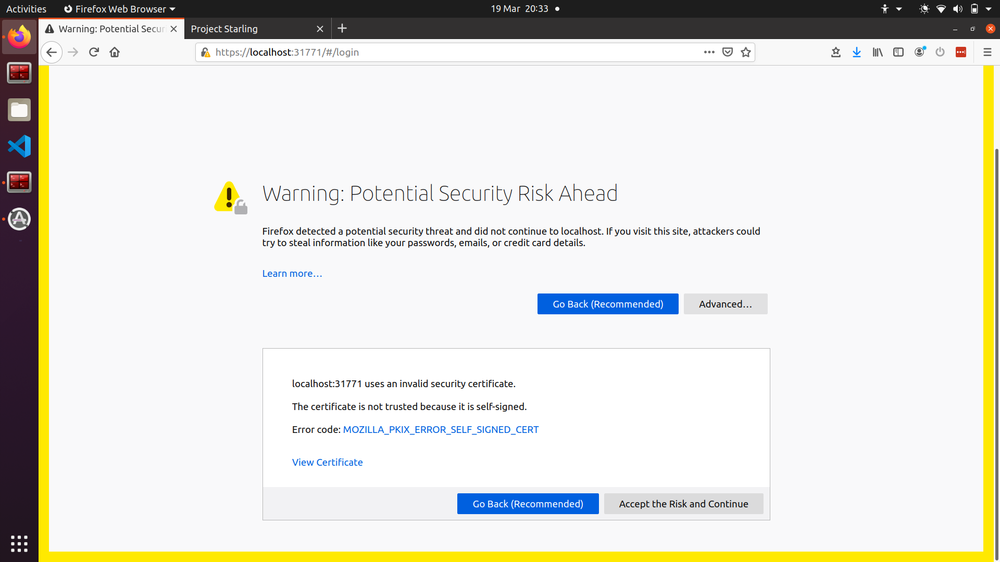
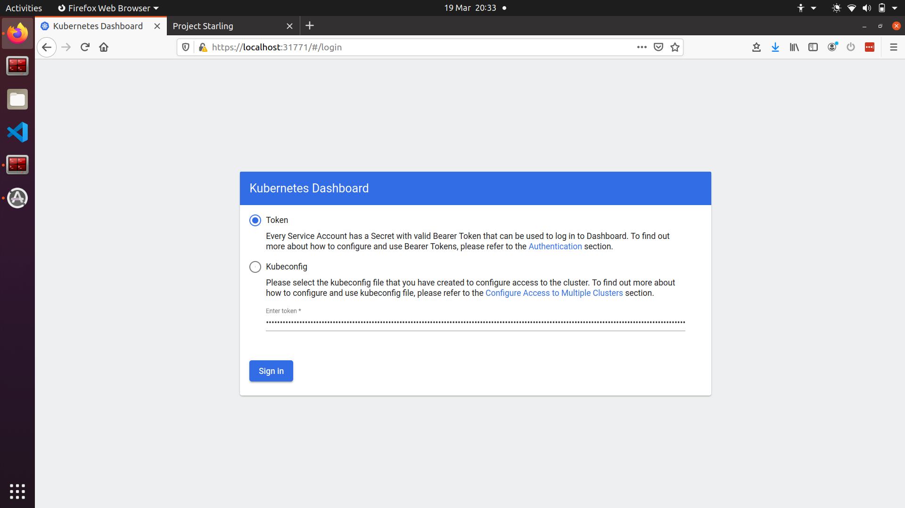
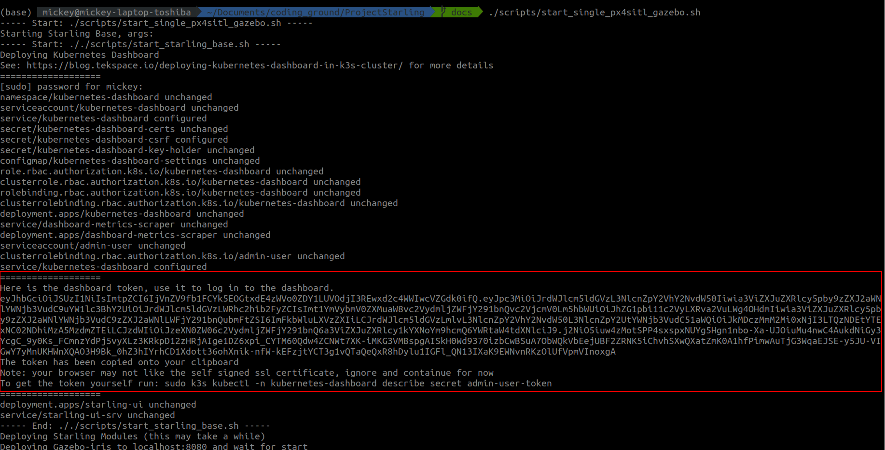
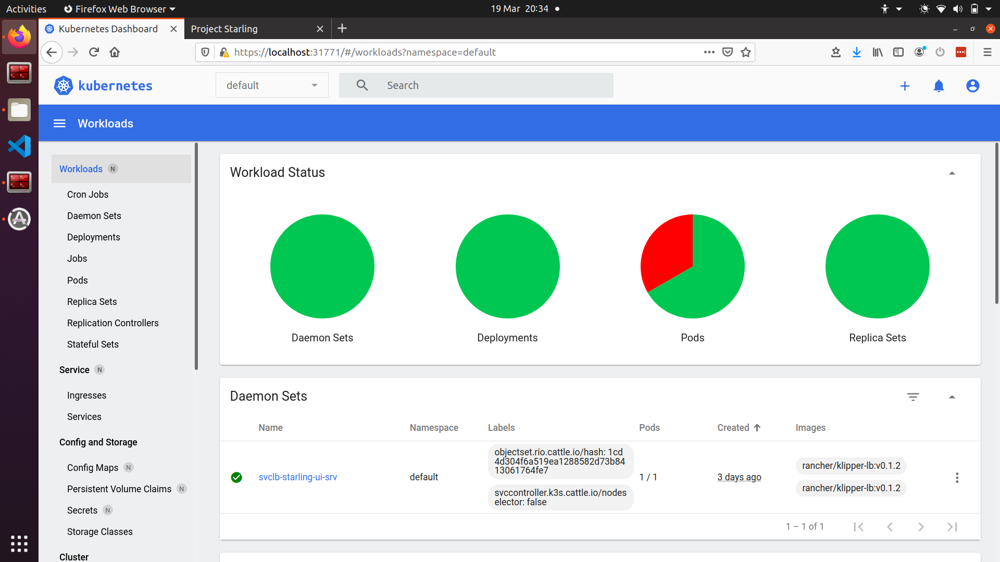
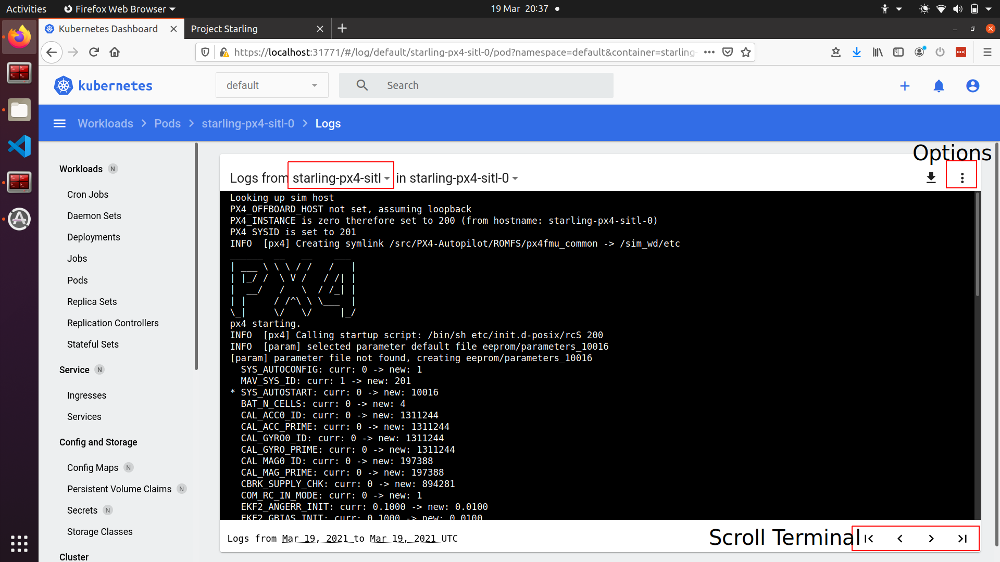
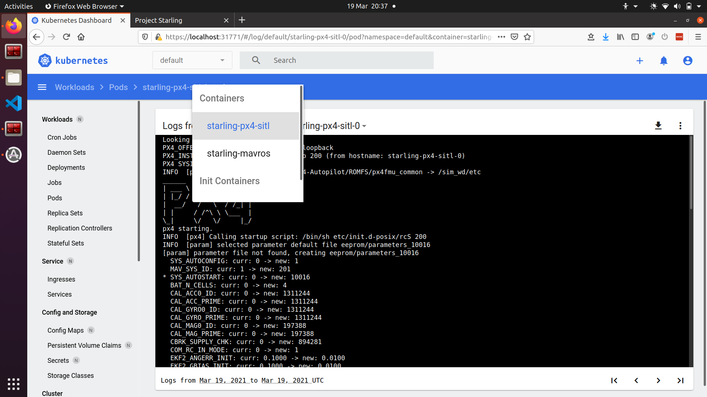

# Kubernetes Dashboard

[TOC]

## Quick GIF


## Logging In

Connecting to [`https://localhost:31771`](https://localhost:31771) may show a security problem. This is caused by certificate issues. Accept the risk and continue if you are comfortable (this is serving locally anyhow :) )



This will give the following log on page



The token can be found from the initial start of the dashboard, or can be accessed using the following command:
```bash
kubectl -n kubernetes-dashboard describe secret admin-user-token
# or if using the starling cli
starling utils get-dashboard-token
```


## Navigating the Dashboard

Once logged in, the dashboard frontpage looks like the following. This can be accessed via the 'Workloads' button. It shows the current status of the cluster. On the left hand side there is a navigation bar showing the various 'resources' or computational loads which are running on the cluster.



The key types of resources for us is the *Deployment*, *Pod*, *Stateful Set* and *Services*. See [kubernetes docs page](/details/kubernetes.md) for more details. For example, selecting the *Pods* on the left hand panel opens up the currently running pods on the cluster.

Here you can see *starling-px4-0*, *gazebo-v1-<characters>* pods which run the simulated drone and the gazebo simulator, as well as a numver of other pods running networking and other functions.

Any particular Pod can be inspected by clicking on the Pods name.


For example, inspecting the *starling-px4-0* gives the following page. It specifies several useful details including:

- pod name,
- pod creation time,
- pod labels,
- ip address
- and a number of other things

You can access both the container *logs* and also access the container shell to directly execute commands for testing. The buttons for both are in the top right corner of the UI.


Once you have clicked the logs icon, the logs are streamed from the container inside the pod. For example here we see the *starling-px4-sitl* container within the *starling-px4-sitl-0* pod.

The terminal can be scrolled up and down, but has maximum size. If the terminal output has reached maximum size, the arrows in the bottom right can be used to navigate terminal 'pages'. Also note that the terminal does not update in real time. To force update the terminal, click on one of the arrows in the bottom right, or select the auto-update option in the options menu in the top right next to the downloads symbol.



Finally, if a pod has multiple containers running within it, the logs of each container can be viewed using the drop down menu accessed by clicking the container name.

