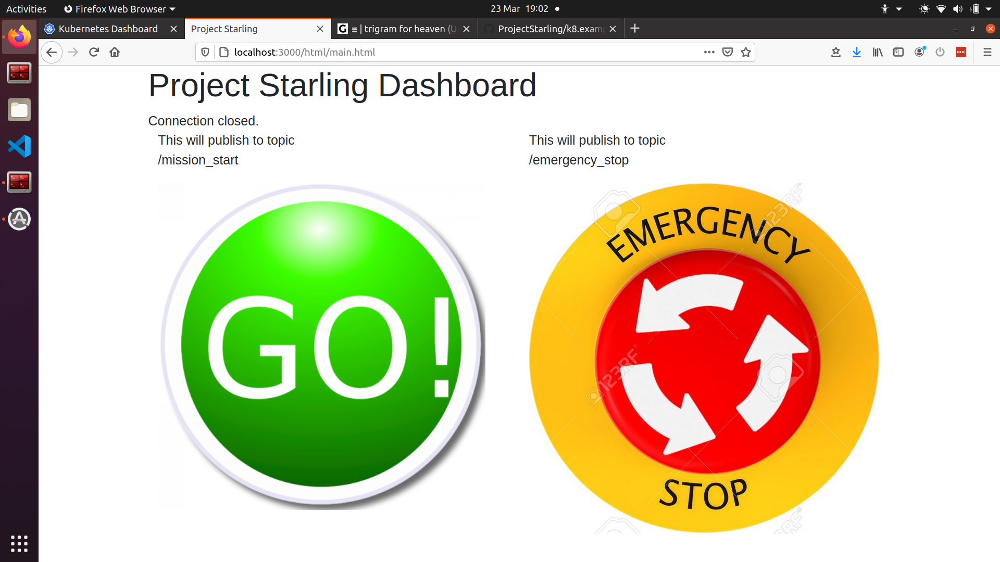

# Starling Initial UI

Builds a container that serves a web-based UI for the system. Uses
RobotWebTools' `ros2-web-bridge` and `rclnodejs` internally.



## Contents
[TOC]

## Layout
Contains several elements:
- Contains a main page which publishes `std_msgs/String` to either the topic `/emergency_stop` or `/mission_start` depending on the button pressed
- The javascript file `html/ros_buttons.js` contains the javascript control for the buttons
- Button images are in the `html/images` directory

### Building

Build through Makefile as normal, target name: `ui` from the `system` Makefile


### Running

To start the image:
`docker run -it --rm -p 3000:3000 -p 9090:9090 starling-ui`

NB: Port 3000 is exposed for the webserver, while port 9090 is exposed for the
websocket.

Once the container is running, navigate to:
[`http://127.0.0.1:3000`](http://127.0.0.1:3000)

In a connected ros2 instance, the command below can be run to see the output.
Note, if the topic has not yet been published to, the command will exit
immediately complaining that it could not determine the type.
fixes: either press the E-STOP button to publish an initial message or supply
the type: `std_msgs/String` as a further argument.

```bash
ros2 topic echo /mission_start
ros2 topic echo /emergency_stop
```

> **NOTE**:
> Note that when running locally using docker, port 9090 is required for ros web bridge traffic.

### Development

To start the image with development folder bound into the container, in this folder run:
```
docker run -it --rm --network projectstarling_default -v "$(pwd)"/html:/ros_ws/src/ros2-web-bridge/examples/html/ -p 3000:3000 -p 9090:9090 starling-ui
```
This will bind mount the html folder into the wanted directory.

This will allow local changes made to the web files to be reflected by refreshing the page brings.

### Kubernetes Deployment

The UI can also be run within the kubernetes deployment and network. To start as a kubernetes Deployment simply apply the `kubernetes.yaml` file in this directory.
```bash
sudo k3s kubectl apply -f kubernetes.yaml
```

This will both start the `uobflightlabstarling/starling-ui` image, and a kubernetes service which exposes the website to outside of the cluster. The web page is then located at [https://localhost:3000](https://localhost:3000).

> **NOTE**:
> Localhost port 9090 is also used for `ros_bridge` traffic

## Notes

To support the full gamut of MAVROS messages, this will likely need to be built
on top of an image containing the mavros_msgs package for ROS2. Lots of things
are likely to need this so it may be worth making this one of the base layers
for the system.