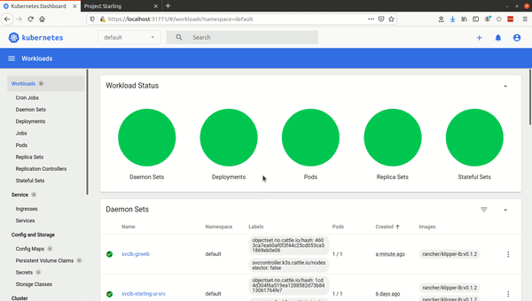

# Multiple Drones Local Machine


Follow these instructions for quick and easy testing of controllers on multiple simulated drones on a single local machine. **Use in the following scenarios**:

1. Local development of multiple drone applications in simulation (gazebo)
2. Local development of offboard control (drone control software on pc not on drone)
3. Local development of distributed onboard control (drone control software running on drone itself)
4. Testing controllers/software on the real drone software/ communications architecture that would be used in the BRL.

**This is considered to be step 2b for the Starling development process.**

> **Note:** Reading the [background](../details/background.md) may be useful but not necessary.

## Contents
[TOC]

## Drone and Simulator on a local cluster

First check that you have installed the single prerequisit of `docker`, see [Getting Started](../guide/getting-started)
### Starting the cluster

In the root directory run one of the following in a terminal
```bash
./run_k3s.sh
./run_k3s.sh -ow # Will automatically open the UI webpages for you. 
``` 
This will start the following:

1. Install the cluster root node which governs the running of all the other parts.
2. A node running the Gazebo simulation environment 
3. A node running the following:
    1. An initialisation routine spawning 1 Iris quadcopter model 
    2. A SITL (Software In The Loop) instance running the PX4 autopilot.
    3. A MAVROS node connected to the SITL instance 
4. A simple UI with a go and estop button. 
5. The cluster control dashboard (printing out the access key string)

> **Note:** this might take a while on first run as downloads are required.

> **Note:** this installation will ask for root (sudo) permission when necessary.

The User Interfaces are available in the following locations:

- Go to [`http://localhost:8080`](http://localhost:8080) in a browser to (hopefully) see the gazebo simulator.
- Go to [`http://localhost:3000/html/main.html`](http://localhost:3000/html/main.html) in a browser to see the starling user interface containing go/stop buttons.
- Go to [`http://localhost:31771`](http://localhost:31771) in a browser to see the cluster dashboard. There is a lot here, and this guide will point you to the key functions. Please see [this page](../details/kubernetes-dashboard.md) for further details.
    - Your browser of choice may not like the web-page and complain of certificate errors. Please ignore this and continue onwards. You may have to click 'advanced' or a similar option for the browser to let you in.
    - To log in to the site, you will need the long login Token which is hopefully displayed by `run_k3s.sh`. This token should also be automatically placed onto your clipboard for pasting.

> **Note:** All specified sites can be accessed from other machines by replacing `localhost` with your computer's IP address.

> **Note:** Sometimes it might take a bit of time for the UIs to become available, give it a minute and refresh the page. With Gazebo you may accidentally be too zoomed in, or the grid may not show up. Use the mouse wheel to zoom in and out. The grid can be toggled on the left hand pane.  

### Restarting or deleting the drone or simulator in the cluster

There may be cases where you wish to restart or refresh either the software running on the drones or the simulator itself (e.g. removing old models):
```bash
./run_k3s.sh -d # or --delete will remove the gazebo and drone instances
./run_k3s.sh -r # or --restart will restart the gazebo and drone instances
```

> **Note:** you can also add the `-sk` command which will skip the k3s re-download step and the dashboard check, i.e. `./run_k3s.sh -sk -r`

If you wish to remove the cluster and all associated software from the machine, you will need to uninstall:
```bash
./run_k3s.sh --uninstall 
```
> **Note:** This will remove everything to do with the starling cluster. The dashboard access token will be deleted. The container images will remain on your machine, but to remove those as well run `docker system prune --volumes`. 

### Accessing logs on the dashboard

Please see the [instructions here](../details/kubernetes-dashboard)

### Scaling the number of drones

#### Dashboard

The simplest way to scale the number of drones is via the dashboard as shown below:



The steps are as follows:

1. Select the 'Stateful Sets' page on the sidebar
2. There should be an entry called 'starling-px4-sitl' representing the drone deployment. On the right hand side, there is an option button: ☰. Press the option button and select *Scale*
3. In the *Desired replicas* field, input the number of drones you wish to deploy. Then click *Save* to deploy. 
4. Going to gazebo, the drones should start appearing. The default drone arrangement is in a discrete spiral from (0, 0). 

> **Note:** Right now, drones cannot be removed or despawned from the simulator. (Gazebo ROS2 despawning issues). If you have spawned too many, it is currently recommended that you restart gazebo and all the drones using `./script/start_px4sitl_gazebo.sh -r`.  

#### Configuration file

A more permanent way is to specify in the cluster deployment configuration file. Please see [this guide to kubernetes configuraiton files](../details/kubernetes.md#configuration-files) for more information. 

Within a kubernetes configuration of kind *Deployment* or *StatefulSet* specifcation you can set the 'replicas' option. The example configurations are all in the deployment folder of the repository. 

```yaml
apiVersion: apps/v1
kind: Deployment
metadata:
  ...
spec:
  replicas: 3
  ...
```

## Controlling the Drones
### Offboard Control
There are two supported methods for offboard control of either the SITL or real drones.

1. Control drone directly via Mavlink, by Ground Control Station (GCS) or other Mavlink compatible method (e.g. Dronekit).
2. Control drone via ROS2 node

#### 1. Connecting a Ground Control Station via Mavlink

If a mavros or sitl instance is running, there will be a GCS link on `udp://localhost:14553` (hopefully). This means that you can run a GCS such as QGroundControl or Mission Planner:

- Create a comms link to `localhost:14553` on UDP 
- The GCS should auto detect the drone(s) 
- You should be able to control and monitor any sitl drone through the standard mavlink interface. 

This is a quick an easy way to control the SITL instance via Mavlink.

#### 2. Running Example ROS2 Offboard Controller node

An example offboard ROS2 controller can then be connected to SITL by running the following in a terminal:

```bash
./scripts/start_example_controller.sh
```

This will first build the example controller so it is available locally. Then deploy the example controller to the cluster. It will take a few minutes to startup.

When run, the example will confirm in the terminal that it has connected and that it is waiting for mission start. To start the mission, press the green go button in the [starling user interface](http://localhost:3000/html/main.html) which will send a message over `/mission_start` topic. A confirmation message should appear in the terminal, and the drone will arm (drone propellors spinning up) and takeoff. It will fly in circles for 10 seconds before landing and disarming. 

Once the controller has completed, the process will exit and the controller will restart, allowing you to repeat the controller.

If used with multiple vehicles, it will automatically find all drones broadcasting mavros topics, and start a controller for each one. 

To remove or restart the controller, use the `-d` or `-r` options respectively with the script. 

```bash
./scripts/start_example_controller.sh -d # Delete or Remove controller
./scripts/start_example_controller.sh -r # Restart controller
```

> See [example python controller](../guide/example-controller.md) for more details.

### Onboard Control




## Troubleshooting/ FAQs