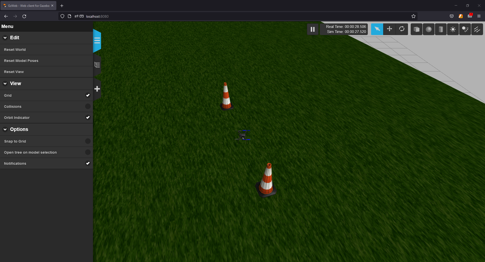
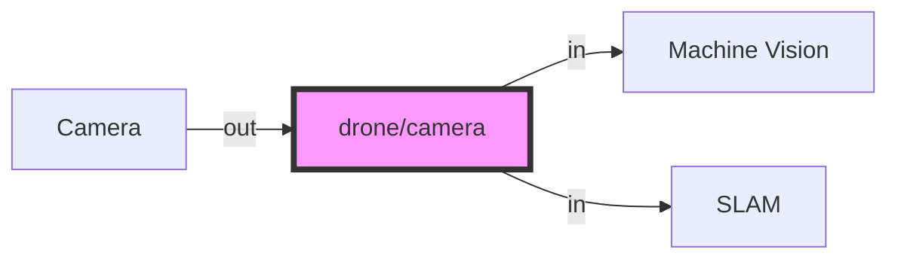
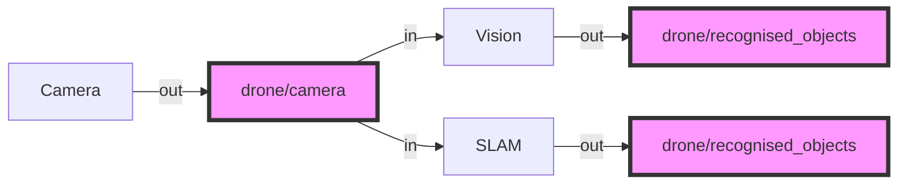
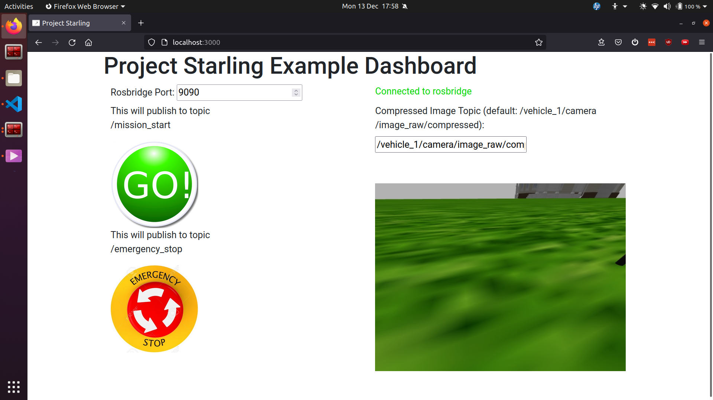

# Introduction to Starling with the Fenswood Scenario

This Tutorial aims to give an introductory overview of the Starling system through the use of the Fenswood Scenario example. It will take a student from the basics of Linux, ROS and Docker to hopefully being able to run the Fenswood Scenario simulation environment with a simple controller flying the drone.

This tutorial was written for the University of Bristol Aerial MSc Group Project 2021.

**On this page:**

[TOC]

## A Brief Introduction to Linux

Adapted from this [digital ocean tutorial](https://www.digitalocean.com/community/tutorials/an-introduction-to-linux-basics)

### What is Linux
Linux is a family of free and open-source operating systems based on the Linux kernel (core operating system). Operating systems based on Linux are known as Linux distributions or distros. Examples include Debian, Ubuntu, Fedora, CentOS, Gentoo, Arch Linux, and many others.

The Linux kernel has been under active development since 1991, and has proven to be extremely versatile and adaptable. You can find computers that run Linux in a wide variety of contexts all over the world, from web servers to cell phones. Today, 90% of all cloud infrastructure and 74% of the world’s smartphones are powered by Linux.

However, newcomers to Linux may find it somewhat difficult to approach, as Linux filesystems have a different structure than those found on Windows or MacOS. Additionally, Linux-based operating systems depend heavily on working with the command line interface, while most personal computers rely on graphical interfaces.

### The Terminal

The terms “terminal,” “shell,” and “command line interface” are often used interchangeably, but there are subtle differences between them:

* A **terminal** is an input and output environment that presents a text-only window running a shell.
* A **shell** is a program that exposes the computer’s operating system to a user or program. In Linux systems, the shell presented in a terminal is a command line interpreter. The default shell in Ubuntu Linux is known as `bash`.
* A **command line interface** is a user interface (managed by a command line interpreter program) which processes commands to a computer program and outputs the results.

When someone refers to one of these three terms in the context of Linux, they generally mean a terminal environment where you can run commands and see the results printed out to the terminal, such as this:


There are two ways to open a terminal:

1. Pressing the ++win++ or ++cmd++ key to open the program menu and typing `terminal`, then pressing ++enter++
2. Pressing ++ctrl+alt+t++

This default terminal is known as the 'gnome-terminal'. Other terminals exist such as ['terminator'](https://terminator-gtk3.readthedocs.io/en/latest/)

Becoming a Linux user requires you to be comfortable with using a terminal. Any administrative task, including file manipulation, package installation, and user management, can be accomplished through the terminal. The terminal is interactive: you specify commands to run (after the $ sign) and the terminal outputs the results of those commands. To execute any command, you type it into the prompt and press ++enter++.

When using the Starling system, interacting with Docker and ROS2, you'll most often be doing so through a terminal shell. Although personal computers that run Linux often come with the kind of graphical desktop environment familiar to most computer users, it is often more efficient or practical to perform certain tasks through commands entered into the terminal. As of writing, a GUI (Graphical User Interface) has not been developed for Starling, and so almost all tasks have to be achieved through the terminal shell.

A basic command to try out is `echo`, which will print things to the terminal. For example `echo hello-world` will print `hello-world` into the terminal. You can also use it to observe the value of **Environment Variables** which record and keep useful variables to the operation of the Operating System. For example, when you run a command in `bash`, `bash` will look for the command executable in the locations provided by the environment variable `PATH`. You can print the contents of this env-var using `echo $PATH`. The `$` before the name of the variable tells `bash` that the following word represents an environment variable, and that it should be looked up.

### Navigating the file system

Like Windows and Mac, the Linux filesystems are based on a directory tree. This means that you can create directories (which are functionally identical to folders found in other operating systems) inside other directories, and files can exist in any directory.

The forward slash (`/`) is used to indicate the root directory in the filesystem hierarchy.

When a user logs in to the shell, they are brought to their own user directory, stored within `/home/<username>`. This is referred to as the user’s home directory. Often you may see the *tilde* (`~`) character when specifying a file location (e.g. `~/Documents/hello.txt` = `/home/<username>/Documents/hello.txt`). This is shorthand for the user's home directory and gets substituted in when used.

To see what directory you are currently active in you can run the `pwd` command, which stands for “print working directory”
```console
myuser@my-machine:~$ pwd
/home/myuser
```

To see a list of files and directories that exist in your current working directory, run the `ls` command:
```console
myuser@my-machine:~$ ls
Documents Desktop Pictures ...
```
You can get more details if you run `ls -al` command:

```console
myuser@my-machine:~$ ls -al
drwxr-xr-x  2 myuser myuser   4096 Apr 30  2021  Desktop
drwxrwxr-x  8 myuser myuser   4096 Oct 29 09:27  Documents
...
```

You can create one or more new directories within your current working directory with the `mkdir` command, which stands for “make directory”. For example, to create two new directories named testdir1 and testdir2, you might run the first command. You can create nested directories by using the `-p` option:
```console
myuser@my-machine:~$ mkdir testdir1 testdir2
myuser@my-machine:~$ mkdir -p testdir3/testsubdir
```

To navigate into one of these new directories, run the cd command (which stands for “change directory”) and specify the directory’s name:
```console
myuser@my-machine:~$ cd testdir1
myuser@my-machine:~/testdir1$
```

Note that you can navigate from anywhere to anywhere. `cd` only requires a valid filepath. Note also that `.` represents the current folder and `..` represents the parent folder. Note also how is shows the current working directory in the shell as well.
```bash
cd # This will bring you back to home directory
cd testdir3/testsubdir # Brings you into testsubdir
cd ../ # Brings you back out one level into testdir3
cd ../testdir1 # Brings you back out one level and back into testdir1
cd /home/<username>/testdir2 # Absolute reference to testdir2
cd ~/testdir2 # Absolute reference using tilde to testdir2
```

### Working with files

You cannot use cd to interact with files; cd stands for “change directory”, and only allows you to navigate directories. You can, however, create, edit, and view the contents of files.

One way to create a file is with the touch command. This creates an empty file in your current working directory. To create a new file called file.txt:
```bash
touch file.txt
```

If you decide to rename file.txt later on, you can do so with the mv command. mv stands for “move” and it can move a file or directory from one place to another. By specifying the original file, file.txt, you can “move” it to a new location in the current working directory, thereby renaming it.
```bash
mv file.txt newfile.txt
```

It is also possible to copy a file to a new location with the cp command. If we want to bring back file.txt but keep newfile.txt, you can make a copy of newfile.txt named file.txt like this:
```bash
cp newfile.txt file.txt
```

However, files are not of much use if they don’t contain anything. To edit files, a file editor is necessary.
There are many options for file editors, all created by professionals for daily use. Such editors include vim, emacs, nano, and pico.
`nano` is a suitable option for beginners: it is relatively user-friendly and doesn’t overload you with cryptic options or commands.
```bash
nano file.txt
```
This will open a space where you can start typing to edit the file. In `nano` specifically you can save your written text by pressing ++ctrl+x++, ++y++, and then ++enter++. This returns you to the shell with a newly saved `file.txt`.

Now that file.txt has some text within it, you can view it using cat or `less`.

The `cat` command prints the contents of a specified file to your system’s output. Try running `cat` and pass the `file.txt` file you just edited as an argument:
```bash
cat file.txt
```

Using `cat` to view file contents can be unwieldy and difficult to read if the file is particularly long. As an alternative, you can use the `less` command which will allow you to paginate the output. Use `less` to view the contents of the file.txt file, like this:
```bash
less file.txt
```
This will also print the contents of file.txt, but one terminal page at a time beginning at the start of the file. You can use the spacebar to advance a page, or the arrow keys to go up and down one line at a time. Press ++q++ to quit out of `less`.

Finally, to delete the file.txt file, pass the name of the file as an argument to `rm`:
```bash
rm file.txt
rm -d directory
rmidr directory
rm -r directory # If the directory you are deleting is not empty
```

> **NOTE**: If your question has to do with a specific Linux command, the manual pages offer detailed and insightful documentation for nearly every command. To see the `man` page for any command, pass the command’s name as an argument to the `man` command - `man command`.
> For instance, `man rm` displays the purpose of `rm`, how to use it, what options are available, examples of use, and more useful information.


> **NOTE**: If a command fails or is hanging or you just want to stop it, most of the time you can stop the running process by pressing ++ctrl+c++. This will send a Keyboard Interrupt message to the program and hopefully stop it.

### Connecting the laptop to the Internet (Eduroam)

For University of Bristol students connecting to Eduroam see theese [instructions](https://www.wireless.bris.ac.uk/eduroam/instructions/go-ubuntu/)

### Installing Dependencies and Useful Programs

Like windows and mac, individual programs can be manually downloaded (usually as a `tar.gz` file instead of `exe`) and manually installed into your operating system (using `dpkg`). However, the linux project offers a much more straight forward method through the `apt` (Advanced Packaging Tool) utility. `apt` is a free-software user interface that works with core libraries to handle the installation and removal of software on Debian operating systems like Ubuntu. (For other distributions you may come across equivalents like `yum`). This is the primary method for installing software onto your system.

To use `apt`, and more specifically `apt-get` which 'gets' programs for you, you must first run the `update` command to get the current list of all available software. Note that because `sudo` is used, you will most likely need to input your password. `sudo` will be explained below.
```bash
sudo apt-get update
```
> **Note** that it will hang (stop responding) or fail if you are not connected to the internet.

#### Installing Git and VSCode

You can then install your programs using `apt-get install`. For Starling, you will need to use the `git` version control software to both download Starling and eventually build your own controllers. To install `git`, run the following:
```bash
sudo apt-get install git
```

We also recommend the use of [Visual Studio Code](https://code.visualstudio.com/) as your development environment or text editor, but you are free to use whatever you want (atom, notepad++ etc etc). We heavily make use of it during development and recommend a number of extensions. VScode can be installed using the `snap` utility. `snap` is a slightly more modern successor to `apt` for more general programs. `snap` comes ready installed on your linux distrubtion.
```bash
sudo snap install code --classic
```

#### `sudo`
Now in these commands, we have prefixed all of them with `sudo`. `sudo` these days usually stands for `superuser do` and allows a command to be run with the privileges of the superuser (aka the *root* user), if the user has been given permissions to do so. Any command which installs or modifies directories outside of the users home directory will often need superuser privileges to avoid non-superusers from changing things they shouldn't. As the above commands all seek to install programs to the system, they need superuser permissions to do so. Running without `sudo` will give you a permission error. Running a command with `sudo` will ask you for your *own accounts* password.


#### Installing Docker

For Linux systems, see the following [install page](https://docs.docker.com/engine/install/ubuntu/). There are multiple ways of installation docker, but we recommend installing using the repository method:

1. Update the `apt` repository and install requirements

        sudo apt-get update

        sudo apt-get install \
            apt-transport-https \
            ca-certificates \
            curl \
            gnupg \
            lsb-release

2. Add Docker's official GPG key:

        curl -fsSL https://download.docker.com/linux/ubuntu/gpg | sudo gpg --dearmor -o /usr/share/keyrings/docker-archive-keyring.gpg

3. Install Docker (and docker-compose!):

        sudo apt-get update

        sudo apt-get install docker-ce docker-ce-cli docker-compose containerd.io

4. Test Docker installation:

        sudo docker run hello-world

This will install Docker, accessible using `sudo` root privileges only. To use docker without sudo, run the following (there are [security issues](https://docs.docker.com/engine/install/linux-postinstall/#manage-docker-as-a-non-root-user) with this, but it doesn't matter for running Starling locally)

1. Run the following

        sudo groupadd docker
        sudo usermod -aG docker $USER

2. Log out and log in again to enforce changes
3. Verify that it was successful (we will come back to this command):

        docker run hello-world

That is Docker on Linux installed. See [the original page](https://docs.docker.com/engine/install/ubuntu/) for any further details.

## Starling and Docker

So now we have installed this thing called **Docker** - but what is it, and why does it matter to you as a user of Starling. **For now, we recommend you treat `docker` as a special program that runs programs which we have written for you to use.** For the purposes of this session we will not yet go into the details - we'll leave that for a future session, but we can at least give you a flavour of what Docker has allowed us to do.


### What is the purpose of Starling

The purpose of Starling, for the use of this course, is to allow you to quickly and easily install and run a UAV simulation within a simulated environment, so that you can test your developed controllers against a semi-realistic scenario.

Therefore Starling is a set of pre-built programs/executables, some of which are pre-configured for the following:

*   Running a Physics Simulation with Visualisation
*   Running the Drone autopilot control software locally (a.k.a Software In The Loop or SITL)
*   Running the interface between Mavlink and other protocols such as the Robot Operating System (ROS)
*   And many others...

These pre-built programs, which we refer to as **containers**, are all available in the [StarlingUAS repository on github](https://github.com/StarlingUAS).

Together these **containers** form a modular ecosystem of drone systems which can be composed together to develop software for real drones. Any controllers developed via the simulator can be directly ported to run on a real drone.

### What 'magic' is docker doing

Perhaps it is easiest to explain what we (and you) would have to do if docker did not exist! Each of the elements described above uses its own programs. For example the physics simulator is a program called [gazebo](http://gazebosim.org/). On each of your machines you would have to manually install gazebo and configure it to work. Then you would have to do the same for SITL, Mavlink, ROS and so on, and then make sure all of them work together - configuration files, scripts etc etc. And still this is without considering how to write software which will run on a drone on a different computer altogther (we don't want the 'but sir, it worked on my machine' syndrome!).

With docker, we have essentially **packaged** up the software with all of it's dependencies and configurations to provide only the specific service we want it to provide. We have already figured out how to install and configure, say, gazebo, and how to get it running with everything else, put those instructions together and released it to you as a **container**.

Almost as importantly, because the installation and configuration is baked into the container, the system itself runs in a **consistent and replicatable environment**, hopefully allowing reproducable results each time. This can be different from running 'bare metal' on your local machine where you may have accidentally changed a configuration without knowing - leading to things going wrong.

All of this means that it's less work for you as the user, as you don't need to go through the difficulties of set-up and installation of all the many individual components. And it's better for us as we can get down to the interesting stuff quicker making life better for everyone!

## Running the Example Fenswood Scenario

This year, the group project revolves around the flight of a single UAV to a 'volcano' at Fenswood Farm. Therefore we have provided this fenswood scenario to all students.

**The fenswood scenario repository is here: [https://github.com/StarlingUAS/FenswoodScenario](https://github.com/StarlingUAS/FenswoodScenario)**

This section takes you through step by step as to how to download and run the example, and a bit of information as to what the example contains. This information is also in the example repository README.

### Getting the Example Scenario

The example is packaged as github repository. For information on what is github see [this article](https://www.howtogeek.com/180167/htg-explains-what-is-github-and-what-do-geeks-use-it-for/).

In order to run the example scenario, you will first need to 'clone' the repository locally. Therefore, navigate to a location in the file system where you want to store the repository (e.g. `cd ~/Documents`) and run the following:
```bash
git clone https://github.com/StarlingUAS/FenswoodScenario.git
```
> *Note*: this is why we needed to install `git` earlier using `apt`

This will download the repository folder into your local directory. Navigate into the folder using `cd`:
```console
myuser@my-machine:~/Documents$ cd FenswoodScenario
myuser@my-machine:~/Documents/FenswoodScenario$ ls
README.md                 docker-compose.windows.yml  foxglove_layout.json
docker-compose.linux.yml  fenswood
```

Then you will need to download the associated starling containers to run the simulator and SITL. Thankfully, this is fairly straightforward and can be run by doing the following:
```bash
myuser@my-machine:~/Documents/FenswoodScenario$ docker-compose -f docker-compose.linux.yml pull
Pulling simhost         ...
Pulling sitl            ...
Pulling mavros          ...
Pulling rosbridge-suite ...
Pulling ui
```

Breaking down this command,

- `docker-compose` is a utility which allows us to compose together multiple docker containers, i.e. run multiple containers together.
- `-f docker-compose.linux.yml` specifies that `docker-compose` should read the configuration yaml file given by `-f`. `docker-compose.linux.yml` is a configuration file we have written which specifies the containers and configurations required to run the fenswood scenario. In this file, we have speciifed that 4 containers will be run.
- `pull` specifies that we would like to download the required containers locally, but not run them just yet.

This command may take between 20 to 30 minutes as it has to download some large content - the simulator itself is around 5Gb! It is recommended you keep reading and have a look at [section 5.4 (a brief introduction to ROS)](#a-brief-introduction-to-ros) while waiting.

The downloaded containers are not stored in your local directory, instead they are stored by docker in a local library on your own machine. All downloaded and local containers can be seen by typing.
```console
myuser@my-machine:~/Documents/FenswoodScenario$ docker images
```

### Running the Example Scenario

Once the download of `pull` has completed, you can run the scenario. To run the example scenario, it is a similar command except now you ask it to `up`:
```console
myuser@my-machine:~/Documents/FenswoodScenario$ docker-compose -f docker-compose.linux.yml up
```

This will start 4 containers:

1. **simhost**: The physics simulator instance which also hosts the simulated drone model and the target spawning.
2. **sitl**: The software in the loop representing the onboard autopilot software.
3. **mavros**: This is the bridge between Mavlink and ROS. It also serves to send mavlink messages to a ground station.
4. **rosbridge-suite**: This is a ros-web interface that is placed there for future use.
4. **ui**: This is the example ui.


Wait a minute or so for all of the containers to initialise. Once started, the simulator should be available to see in the browser.

1. Open up the firefox browser (click on firefox on the sidebar, or press ++win++ and search for firefox)
2. Go to [https://localhost:8080](https://localhost:8080)
3. You should see something like the following



The web interface is known as Gazebo Web. You can fly your camera through the environment like many other 3D modelling software:

- Left Click on a location and drag does Panning/Translating
- Middle Click on a location and drag does rotating around a point
- Scrolling the Middle Mouse button will zoom you in and out.


The full process as a gif:


## A Brief Introduction to ROS

This sections is adapted from [this article](https://dev.to/caelinsutch/a-brief-introduction-to-the-robot-operating-system-ros-15m5)

ROS stands for the Robot Operating System, yet it isn't an actual operating system. It's a framework designed to expedite the development time of robot platforms. To understand what ROS is, we should understand why ROS exists in the first place.

### Why does ROS exist?

In general, software developers avoid hardware like the plague. It's messy, doesn't have consistent behavior, and there's no ctrl-z in sight.

Most beginner programmers think you have to have a deep knowledge of electronics and even mechanics to program robots. They think that the hardware and software are so tightly coupled, you have to know both in depth to build anything useful.

Software developers became software developers for a reason, so they don't have to deal with hardware. For example, lets say you have to debug a faulty sensor. You first have to take out the sensor from the enclosure, test the sensor thoroughly with a multi meter and various test cases, document its behavior, then examine the hardware -level code to ensure that there were no bugs, and so on. That's a lot of interaction with the hardware that's not fun for someone who just wants to write some cool software.

It's harder to attract good programmers if the programming is coupled deeply with hardware. This is where ROS comes into play. With ROS, you can completely abstract the hardware from software, and instead interact with an API that gives access to that data. You can forget about the hardware, and focus on developing the software that makes the robot do what you want.

### What is ROS

ROS is essentially a framework that sits on top of an operating system which defines how particular ROS compatible programs communicate and share data with each other. Essentially ROS defines an interface between which compatible programs can communicate and interact with each other. Over the years that ROS has existed, many people have developed thousands of ROS compatible packages which can be used in a modular fashion.

### ROS concepts through an example

To make it more concrete, imagine that on your drone you have a camera. There are also two processes which require, as inputs, that camera image. Say, a machine learning program, and a position estimation program. Traditionally, you would have to manually serialise (compress) and stream the image over a port which the other two programs could read from. But if the port changes or, say, the camera changes, lots of things have to be reconfigured.

However, this sort of interaction can be made streamlined in ROS. Let us consider the programs we have as ROS **nodes**, i.e. a program which is responsible for one single modular purpose, with particular inputs or outputs:

1. A camera image streaming node
    - OUT: camera image
2. A machine vision system for recognising objects
    - IN: camera image
    - OUT: list of recognised objects
3. A simultaneous localisation and mapping system.
    - IN: camera image
    - OUT: vehicle position

These outputs of a node define ROS **topics**, i.e. a single stream of one type of data. Each topic has a particular name which can be referred to. In our example, some of the topics might be:

- `/drone/camera` for the camera image
- `/drone/recognised_objects` for the machine vision system
- `/drone/slam_position` for the SLAM system

Then, we see that there are two avenues of communication created from these node inputs and outputs.



Now ROS follows a **publisher/subscriber** model of communication. What that means is that nodes **publish** data to `topics` as outputs. But that data is only sent across the network if a different nodes also **subscribes** to the same topic. So in our example we end up having

1. A camera image streaming node
    - OUT: publishing to `/drone/camera`
2. A machine vision system for recognising objects
    - IN: subscribed to `/drone/camera`
    - OUT: publishing to `/drone/recognised_objects`
3. A simultaneous localisation and mapping system.
    - IN: subscribed to `/drone/camera`
    - OUT: publishing to `/drone/slam_position`



Finally, the data that is sent is not just anything. The data or **message** is a specifically templated packet of data containing things specified for that paricular use case. In our example for `/drone/slam_position` topic, the message might be of type [`geometry_msgs/msg/Point.msg`](https://github.com/ros2/common_interfaces/blob/master/geometry_msgs/msg/Point.msg) which is defined like so:
```
# This contains the position of a point in free space
float64 x
float64 y
float64 z
```
In other words the message that the `/drone/slam_position` topic publishes must have a `msg.x`, `msg.y` and `msg.z` field, and the subscriber will only receivea message with those fields. There are a number of messages in the standard ROS library, but many libraries also define their own - as have we in some parts of Starling.

This can be summarised in this diagram from the [ROS tutorials](https://docs.ros.org/en/foxy/Tutorials/Understanding-ROS2-Nodes.html) demonstrates it very nicely:


The bottom half of this shows how topics get sent from a publisher to a subscriber.

Interestingly, if you put two topics together, you get some notion of two way communication. This is the basis of a **service** which can be seen in the top of the diagram. A **service** is made of a Request topic and a Response topic, but functions as a single communication type to the user. Similar to messages, a service has a defined request and response types (e.g. see [`std_srvs/srv/SetBool.srv`](https://github.com/ros2/common_interfaces/blob/master/std_srvs/srv/SetBool.srv)).  A service request will often wait until a response is received before continuing.

Note that everything happens asyncronously and in parallel, when a node subscribes or sends a requests, it doesn't know when the response will arrive. It only knows it will (hopefully) arrive at some point. When a packet is received the subscriber can then run a method - this method is usually known as a **callback**, but that will be covered in a later tutorial.

So in summary, the key conepts and terminology are:

- **Nodes**
- **Topics**
- **Publishers and Subscribers**
- **Messages**
- **Services**

### ROS2 for Starling
There are 2 versions of ROS - ROS1 and ROS2. ROS1, initially created in 2007 by Willow Garage, has become huge among the open source robotics community. However over the years they realised that there are a number of important features which are missing - and adding all of these would simply break ROS1. Also the most recent ROS1 distribution (ROS Noetic) is soon to reach the end of its supported life (EOL 2025) with no more ROS1 there after! (See [this article](https://roboticsbackend.com/ros1-vs-ros2-practical-overview/#Why_ROS2_and_not_keep_ROS1) for more details!)

Therefore, to future proof the system, and to ensure all users get a well rounded experience that will hopefully translate to industry experience, Starling has been implemented in ROS2. Specifically, Starling uses the **Foxy Fitzroy** Long Term Support (LTS) distribution throughout.

There are some interesting changes between ROS1 and ROS2, but the core elements described above remain identical. A future tutorial will go into a few more details, but this is probably all the context you will need for now!

> **Note:** Main thing to be aware of is if you are debugging and searching for ROS questions on the internet, be aware that there are many existing questions for ROS1 which will no longer apply for ROS2.

## Running the Example UAV Controller

The next step in getting the Fenswood Scenario up and running is to actually get the UAV to do something. The previous steps simply started the simulator up, but now we have to instruct and control the UAV. For now we have provided an example controller to all students (to be turned into a tutorial at a later date)

**The example controller repository is here: [https://github.com/StarlingUAS/example_python_controller](https://github.com/StarlingUAS/example_python_controller)**

This section will take you through step by step as to how to download and run the example, a bit of information about what the example contains. This information is also available in the example repository readme.

### Getting the Example Controller

Similar to the simulator, the example controller is packaged up as a github repository. This repository contains a number of example controllers for use in different scenarios and simulators. There is one particular controller which has been developed for the fenswood scenario.

Again, in order to run the example scenario, you will first need to 'clone' the repository locally. Therefore navigate to a location in the file system where you want to store the repository (e.g. `cd ~/Documents`) and run the following:
```bash
git clone https://github.com/StarlingUAS/example_python_controller.git
cd example_python_controller # Navigate into the folder
```

Now unlike the simulator, you will not need to download the example from the internet. This example is set up so that it will build itself locally when it is run.

### Running the Example Controller

First, open up a terminal and start up the Fenswood Scenario Simulator if you haven't already (Refer to [](#running-the-example-scenario)). Double check it is open by going to Gazebo Web at [https://localhost:8080](https://localhost:8080)

Then, open up a second terminal and navigate to the example_python_controller folder. The example controller can be started by running the following:
```console
myuser@my-machine:~/Documents/example_python_controller$ docker-compose -f docker-compose.fenswood.ap.yaml up
```
With this command, the controller will start off and attempt to find a drone on the network. 

> If a drone has not been found, try restarting the both the Fenswood Scenario and the controller. 

Once a drone has been found, it will attempt to connect to the ardupilot. Once connected the path the vehicle will take is initialised and it is ready to fly if the user sends a mission go.

Now to send a mission go, you can use the provided simple UI that is started with the FenswoodScenario. Navigate to [https://localhost:3000](https://localhost:3000) in the browser, and a UI will start up:



If it says `connected to rosbridge` in green, then you are ready to send a mission start command. Press the Green GO Button. 

If you go to the terminal it should start sending waypoints. In the UI the camera image should start to change as the vehicle takes off, and you should see the vehicle takeoff in gazebo web as well.

Then you should hopefully see its attempt to follow a preset trajectory towards the target location.

This full process can be seen in the following gif:


The landing:

### What is the Example Controller

So what exactly is the example controller doing?

Lets first start with what it is communicating with. On a real drone, the thing that controls the lower level operations of the drone is the **Autopilot** or **Flight controller**. The autopilot contains software which allows for different flight modes and translates hight level commands to motor voltages to fly the drone. As you might have come across, the primary with of controlling the autopilot is through sending Mavlink messages.

Now the autopilot software itself can be swapped out and changed. For this scenario, we use the [**Ardupilot Arducopter**](https://ardupilot.org/copter/docs/introduction.html) firmware for the flight controller. It is important to know the specific type of software as different flight controller firmware requires the use of different flight mode and instructions.

The Fenswood Scenario simulator utilises the Ardupilot Software In The Loop (SITL) simulator. This program is identical to the firmware that would be running onboard the flight controller. Then, within the example controller repository, there are two example controllers - one for Ardupilot (sufficed with `ap`), and one for the PX4 firmware (suffixed with `px4`). You can use the former to communicate with the Ardupilot SITL.

The example controller talks in ROS2 to the SITL via the Mavros translation node mentioned earlier. It sends commands for things like 'takeoff', 'go there' and 'land' via topics which the Mavros node advertises. The Mavros node takes subscribes to these topics and re-publishes them to the Flight Controller using Mavlink in a way Ardupilot understands.

More details will be given in the next tutorial about how this controller works under the hood, and how to develop your own.

## Inspecting and Debugging Starling with Docker and ROS

Now we have the full example Fenswood Scenario running, we can start to inspect what's going on a bit more! This will be more useful when developing your own controller, but this will give you an idea of whether your systems are working or not.

### Inspecting Docker

As you will hopefully be aware now, there's a fair amount going on under the hood! Because of all of these pieces which need to fit together, occasionally things fail, and therefore you will need to be able to inspect whats going on.

As most of Starling relys on using **Docker** we can use some of the docker commands to inspect what is going on!

It is useful to know what docker containers exist locally on your system and whether they are the most recent release. The following command will list your local docker containers images and when they were last released
```
docker images
```

To see what containers are running, you can use the following. When running Fenswood you should see 5 containers running.
```
docker ps
```

When running docker ps, it shows some useful information. You can use this information to inspect the inside of a container. Now what do we mean by the 'inside of a container'. Essentially the container allows us to run a pre-set set of instructions inside a blank mini version of linux. When we are debugging, it is sometimes really useful to have a look at what is going on inside this mini version of linux!

The `exec` command allows us to go inside one of these containers to make changes directly. Note that when we are inside, we are no longer in your own version of the desktop, and that changes made are persistent inside the container! When inside the container, you can run some of the ROS2 comamnds in the next section.
```
docker exec -it <container id> bash
```

If a particular docker container is not working properly, you can also kill a container:
```
docker kill <container id>
```

### Inspecting ROS2

As mentioned before, everything in starling is running ROS2. Therefore all of the ROS2 nodes, topics and services can be inspected and observed. We can do this inspection using the following few commands.

First ensure that you have `docker exec` into any of the containers. For example using the container id of the container labelled `starling-mavros`.

Once you are inside, you first need to run the following to enable ROS2 commands. (++tab++ autocompleting is available)
```
source /opt/ros/foxy/setup.bash
```

The first thing you can do is list all of the ROS2 nodes in the network `node` command:

```
ros2 node list
```

This will show a list of all the nodes that ROS2 can find. You should see all of the nodes from the simulator and the example controller.

Then, we can inspect the list of available topics using the `topic` command.

```
ros2 topic list
```

If there is a particular topic you want to inspect, you can use the `echo` command of `topic`, for example if we wanted to inspect the topic `/vehicle_1/mavros/state` we can run:

```
ros2 topic echo /vehicle_1/mavros/state
```

This should (assuming the connection to all of the other elements is working) start printing out the current state of the drone. Including whether it is armed or not, and which mode it is currently in.

Finally, you can also inspect the services on the network using the `service` command like the following:

```
ros2 service list
```

## Summary and Conclusion

Congratulations! You have gotten to the end of this tutorial!

Especially if this is your first time touching linux and using this stuff, a lot of the content here can be daunting - but feel free to read it over again and hopefullly you will slowly come to understand what is going on.

In this introductory tutorial, we have only really scratched the surface of a lot of the technologies that we've been using. If you wish to have a deeper understanding, I would recommend having a read through the official documentation of all of them. The [docker](https://www.docker.com/101-tutorial) and [ROS2 tutorials](https://docs.ros.org/en/foxy/Tutorials.html) are really good. But I wish to emphasise that you will hopefully not need an extremely deep understanding to use Starling.

The next step after this tutorial is then to cover how you might actually build your own controller. This will go into more detail about Mavlink, ROS2 and Docker - including how to build your own projects and run them against the Fenswood Scenario Simulator!