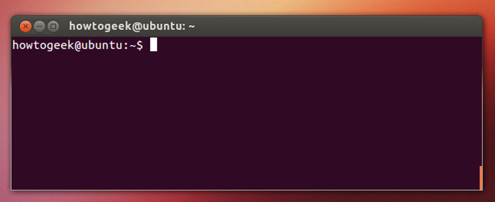

# Introduction to Starling with the Fenswood Scenario

This Tutorial aims to give an introductory overview of the Starling system through the use of the Fenswood Scenario example. It will take a student from the basics of Linux, ROS and Docker to hopefully being able to run the Fenswood Scenario simulation environment with a simple controller flying the drone.

This tutorial was written for the University of Bristol Aerial MSc Group Project 2021.

**On this page:**

[TOC]

## A Brief Introduction to Linux

Adapted from this [digital ocean tutorial](https://www.digitalocean.com/community/tutorials/an-introduction-to-linux-basics)

### What is Linux
Linux is a family of free and open-source operating systems based on the Linux kernel (core operating system). Operating systems based on Linux are known as Linux distributions or distros. Examples include Debian, Ubuntu, Fedora, CentOS, Gentoo, Arch Linux, and many others.

The Linux kernel has been under active development since 1991, and has proven to be extremely versatile and adaptable. You can find computers that run Linux in a wide variety of contexts all over the world, from web servers to cell phones. Today, 90% of all cloud infrastructure and 74% of the world’s smartphones are powered by Linux.

However, newcomers to Linux may find it somewhat difficult to approach, as Linux filesystems have a different structure than those found on Windows or MacOS. Additionally, Linux-based operating systems depend heavily on working with the command line interface, while most personal computers rely on graphical interfaces.

### The Terminal

The terms “terminal,” “shell,” and “command line interface” are often used interchangeably, but there are subtle differences between them:

* A **terminal** is an input and output environment that presents a text-only window running a shell.
* A **shell** is a program that exposes the computer’s operating system to a user or program. In Linux systems, the shell presented in a terminal is a command line interpreter. The default shell in Ubuntu Linux is known as `bash`.
* A **command line interface** is a user interface (managed by a command line interpreter program) which processes commands to a computer program and outputs the results.

When someone refers to one of these three terms in the context of Linux, they generally mean a terminal environment where you can run commands and see the results printed out to the terminal, such as this:



There are two ways to open a terminal:

1. Pressing the ++win++ or ++cmd++ key to open the program menu and typing `terminal`, then pressing ++enter++
2. Pressing ++ctrl+alt+t++

This default terminal is known as the 'gnome-terminal'. Other terminals exist such as ['terminator'](https://terminator-gtk3.readthedocs.io/en/latest/)

Becoming a Linux user requires you to be comfortable with using a terminal. Any administrative task, including file manipulation, package installation, and user management, can be accomplished through the terminal. The terminal is interactive: you specify commands to run (after the $ sign) and the terminal outputs the results of those commands. To execute any command, you type it into the prompt and press ++enter++.

When using the Starling system, interacting with Docker and ROS2, you'll most often be doing so through a terminal shell. Although personal computers that run Linux often come with the kind of graphical desktop environment familiar to most computer users, it is often more efficient or practical to perform certain tasks through commands entered into the terminal. As of writing, a GUI (Graphical User Interface) has not been developed for Starling, and so almost all tasks have to be achieved through the terminal shell.

A basic command to try out is `echo`, which will print things to the terminal. For example `echo hello-world` will print `hello-world` into the terminal. You can also use it to observe the value of **Environment Variables** which record and keep useful variables to the operation of the Operating System. For example, when you run a command in `bash`, `bash` will look for the command executable in the locations provided by the environment variable `PATH`. You can print the contents of this env-var using `echo $PATH`. The `$` before the name of the variable tells `bash` that the following word represents an environment variable, and that it should be looked up.

### Navigating the file system

Like Windows and Mac, the Linux filesystems are based on a directory tree. This means that you can create directories (which are functionally identical to folders found in other operating systems) inside other directories, and files can exist in any directory.

The forward slash (`/`) is used to indicate the root directory in the filesystem hierarchy.

When a user logs in to the shell, they are brought to their own user directory, stored within `/home/<username>`. This is referred to as the user’s home directory. Often you may see the *tilde* (`~`) character when specifying a file location (e.g. `~/Documents/hello.txt` = `/home/<username>/Documents/hello.txt`). This is shorthand for the user's home directory and gets substituted in when used.

To see what directory you are currently active in you can run the `pwd` command, which stands for “print working directory”
```console
myuser@my-machine:~$ pwd
/home/myuser
```

To see a list of files and directories that exist in your current working directory, run the `ls` command:
```console
myuser@my-machine:~$ ls
Documents Desktop Pictures ...
```
You can get more details if you run `ls -al` command:

```console
myuser@my-machine:~$ ls -al
drwxr-xr-x  2 myuser myuser   4096 Apr 30  2021  Desktop
drwxrwxr-x  8 myuser myuser   4096 Oct 29 09:27  Documents
...
```

You can create one or more new directories within your current working directory with the `mkdir` command, which stands for “make directory”. For example, to create two new directories named testdir1 and testdir2, you might run the first command. You can create nested directories by using the `-p` option:
```console
myuser@my-machine:~$ mkdir testdir1 testdir2
myuser@my-machine:~$ mkdir -p testdir3/testsubdir
```

To navigate into one of these new directories, run the cd command (which stands for “change directory”) and specify the directory’s name:
```console
myuser@my-machine:~$ cd testdir1
myuser@my-machine:~/testdir1$
```

Note that you can navigate from anywhere to anywhere. `cd` only requires a valid filepath. Note also that `.` represents the current folder and `..` represents the parent folder. Note also how is shows the current working directory in the shell as well.
```bash
cd # This will bring you back to home directory
cd testdir3/testsubdir # Brings you into testsubdir
cd ../ # Brings you back out one level into testdir3
cd ../testdir1 # Brings you back out one level and back into testdir1
cd /home/<username>/testdir2 # Absolute reference to testdir2
cd ~/testdir2 # Absolute reference using tilde to testdir2
```

### Working with files

You cannot use cd to interact with files; cd stands for “change directory”, and only allows you to navigate directories. You can, however, create, edit, and view the contents of files.

One way to create a file is with the touch command. This creates an empty file in your current working directory. To create a new file called file.txt:
```bash
touch file.txt
```

If you decide to rename file.txt later on, you can do so with the mv command. mv stands for “move” and it can move a file or directory from one place to another. By specifying the original file, file.txt, you can “move” it to a new location in the current working directory, thereby renaming it.
```bash
mv file.txt newfile.txt
```

It is also possible to copy a file to a new location with the cp command. If we want to bring back file.txt but keep newfile.txt, you can make a copy of newfile.txt named file.txt like this:
```bash
cp newfile.txt file.txt
```

However, files are not of much use if they don’t contain anything. To edit files, a file editor is necessary.
There are many options for file editors, all created by professionals for daily use. Such editors include vim, emacs, nano, and pico.
`nano` is a suitable option for beginners: it is relatively user-friendly and doesn’t overload you with cryptic options or commands.
```bash
nano file.txt
```
This will open a space where you can start typing to edit the file. In `nano` specifically you can save your written text by pressing ++ctrl+x++, ++y++, and then ++enter++. This returns you to the shell with a newly saved `file.txt`.

Now that file.txt has some text within it, you can view it using cat or `less`.

The `cat` command prints the contents of a specified file to your system’s output. Try running `cat` and pass the `file.txt` file you just edited as an argument:
```bash
cat file.txt
```

Using `cat` to view file contents can be unwieldy and difficult to read if the file is particularly long. As an alternative, you can use the `less` command which will allow you to paginate the output. Use `less` to view the contents of the file.txt file, like this:
```bash
less file.txt
```
This will also print the contents of file.txt, but one terminal page at a time beginning at the start of the file. You can use the spacebar to advance a page, or the arrow keys to go up and down one line at a time. Press ++q++ to quit out of `less`.

Finally, to delete the file.txt file, pass the name of the file as an argument to `rm`:
```bash
rm file.txt
rm -d directory
rmidr directory
rm -r directory # If the directory you are deleting is not empty
```

> **NOTE**: If your question has to do with a specific Linux command, the manual pages offer detailed and insightful documentation for nearly every command. To see the `man` page for any command, pass the command’s name as an argument to the `man` command - `man command`.
> For instance, `man rm` displays the purpose of `rm`, how to use it, what options are available, examples of use, and more useful information.

### Connecting the laptop to the Internet (Eduroam)

For University of Bristol students connecting to Eduroam see theese [instructions](https://www.wireless.bris.ac.uk/eduroam/instructions/go-ubuntu/)

### Installing Dependencies and Useful Programs

Like windows and mac, individual programs can be manually downloaded (usually as a `tar.gz` file instead of `exe`) and manually installed into your operating system (using `dpkg`). However, the linux project offers a much more straight forward method through the `apt` (Advanced Packaging Tool) utility. `apt` is a free-software user interface that works with core libraries to handle the installation and removal of software on Debian operating systems like Ubuntu. (For other distributions you may come across equivalents like `yum`). This is the primary method for installing software onto your system.

To use `apt`, and more specifically `apt-get` which 'gets' programs for you, you must first run the `update` command to get the current list of all available software. Note that because `sudo` is used, you will most likely need to input your password. `sudo` will be explained below.
```bash
sudo apt-get update
```
> **Note** that it will hang (stop responding) or fail if you are not connected to the internet.

#### Installing Git and VSCode

You can then install your programs using `apt-get install`. For Starling, you will need to use the `git` version control software to both download Starling and eventually build your own controllers. To install `git`, run the following:
```bash
sudo apt-get install git
```

We also recommend the use of [Visual Studio Code](https://code.visualstudio.com/) as your development environment or text editor, but you are free to use whatever you want (atom, notepad++ etc etc). We heavily make use of it during development and recommend a number of extensions. VScode can be installed using the `snap` utility. `snap` is a slightly more modern successor to `apt` for more general programs. `snap` comes ready installed on your linux distrubtion.
```bash
sudo snap install code --classic
```

#### `sudo`
Now in these commands, we have prefixed all of them with `sudo`. `sudo` these days usually stands for `superuser do` and allows a command to be run with the privileges of the superuser (aka the *root* user), if the user has been given permissions to do so. Any command which installs or modifies directories outside of the users home directory will often need superuser privileges to avoid non-superusers from changing things they shouldn't. As the above commands all seek to install programs to the system, they need superuser permissions to do so. Running without `sudo` will give you a permission error. Running a command with `sudo` will ask you for your *own accounts* password.


#### Installing Docker

For Linux systems, see the following [install page](https://docs.docker.com/engine/install/ubuntu/). There are multiple ways of installation docker, but we recommend installing using the repository method:

1. Update the `apt` repository and install requirements

        sudo apt-get update

        sudo apt-get install \
            apt-transport-https \
            ca-certificates \
            curl \
            gnupg \
            lsb-release

2. Add Docker's official GPG key:

        curl -fsSL https://download.docker.com/linux/ubuntu/gpg | sudo gpg --dearmor -o /usr/share/keyrings/docker-archive-keyring.gpg

3. Install Docker (and docker-compose!):

        sudo apt-get update

        sudo apt-get install docker-ce docker-ce-cli docker-compose containerd.io

4. Test Docker installation:

        sudo docker run hello-world

This will install Docker, accessible using `sudo` root privileges only. To use docker without sudo, run the following (there are [security issues](https://docs.docker.com/engine/install/linux-postinstall/#manage-docker-as-a-non-root-user) with this, but it doesn't matter for running Starling locally)

1. Run the following

        sudo groupadd docker
        sudo usermod -aG docker $USER

2. Log out and log in again to enforce changes
3. Verify that it was successful (we will come back to this command):

        docker run hello-world

That is Docker on Linux installed. See [the original page](https://docs.docker.com/engine/install/ubuntu/) for any further details.

## Starling and Docker

So now we have installed this thing called **Docker** - but what is it, and why does it matter to you as a user of Starling. **For now, we recommend you treat `docker` as a special program that runs programs which we have written for you to use.** For the purposes of this session we will not yet go into the details - we'll leave that for a future session, but we can at least give you a flavour of what Docker has allowed us to do.


### What is the purpose of Starling

The purpose of Starling, for the use of this course, is to allow you to quickly and easily install and run a UAV simulation within a simulated environment, so that you can test your developed controllers against a semi-realistic scenario.

Therefore Starling is a set of pre-built programs/executables, some of which are pre-configured for the following:

*   Running a Physics Simulation with Visualisation
*   Running the Drone autopilot control software locally (a.k.a Software In The Loop or SITL)
*   Running the interface between Mavlink and other protocols such as the Robot Operating System (ROS)
*   And many others...

These pre-built programs, which we refer to as **containers**, are all available in the [StarlingUAS repository on github](https://github.com/StarlingUAS).

Together these **containers** form a modular ecosystem of drone systems which can be composed together to develop software for real drones. Any controllers developed via the simulator can be directly ported to run on a real drone.

### What 'magic' is docker doing

Perhaps it is easiest to explain what we (and you) would have to do if docker did not exist! Each of the elements described above uses its own programs. For example the physics simulator is a program called [gazebo](http://gazebosim.org/). On each of your machines you would have to manually install gazebo and configure it to work. Then you would have to do the same for SITL, Mavlink, ROS and so on, and then make sure all of them work together - configuration files, scripts etc etc. And still this is without considering how to write software which will run on a drone on a different computer altogther (we don't want the 'but sir, it worked on my machine' syndrome!).

With docker, we have essentially **packaged** up the software with all of it's dependencies and configurations to provide only the specific service we want it to provide. We have already figured out how to install and configure, say, gazebo, and how to get it running with everything else, put those instructions together and released it to you as a **container**.

Almost as importantly, because the installation and configuration is baked into the container, the system itself runs in a **consistent and replicatable environment**, hopefully allowing reproducable results each time. This can be different from running 'bare metal' on your local machine where you may have accidentally changed a configuration without knowing - leading to things going wrong.

All of this means that it's less work for you as the user, as you don't need to go through the difficulties of set-up and installation of all the many individual components. And it's better for us as we can get down to the interesting stuff quicker making life better for everyone!

## Running the Example Fenswood Scenario

## A Brief Introduction to ROS

## Running the Example UAV Controller

## Inspecting and Debugging Starling with Docker and ROS